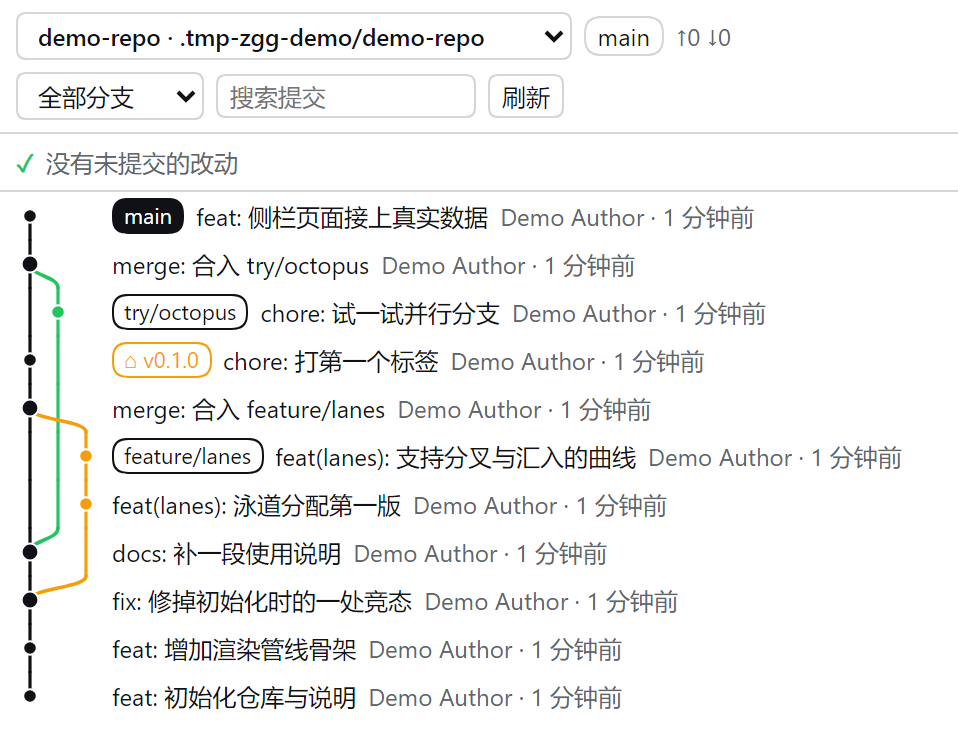

# dsh-sidebar-git-graph

[](https://github.com/AFunDog/dsh-sidebar-git-graph/actions/workflows/ci.yml)
[](LICENSE)

A **right-sidebar page for DSH (DeepSeek Harness)** that draws the current session's
repository as a **branches-and-merges commit graph** — VS Code style: colored lanes,
bezier curves where branches split and merge, ref chips, per-commit details — with a
**working-tree Changes area** above it.

**Read-only.** It never runs `checkout`, `commit`, `reset`, `rebase`, `fetch`, `push`,
`add` or `restore`. The only git commands it runs are `rev-parse`, `status`,
`for-each-ref`, `log` and `diff`.



## Features

- **Working-tree changes, VS Code style** — a **Changes** and a **Staged Changes** section above
  the graph (plus **Merge Changes** during a merge), each row carrying its status letter
  (`M`/`A`/`D`/`R`/`C`/`U`) and its added/deleted line counts. Click a file to expand its diff
  inline; the sections fold and remember it.
- **Branch/merge relationships at a glance** — one lane per concurrent line of history, curved
  connectors where a branch forks or merges back, thicker dots on merge commits, and the HEAD
  lane emphasized.
- **Ref chips per commit** — local branch / remote branch / tag, with the current branch filled in
  the theme's brand color and the theme's matching on-brand foreground.
- **One workspace, several repositories** — a workspace often holds more than one repository (this
  project's own checkout has a nested one under `vendor/@zeng/`). The header then grows a picker
  listing every repository it found; the choice is remembered per workspace. A workspace that is
  itself only a subdirectory of a repository works too — the enclosing repository is offered as
  well. Discovery never leaves the workspace: it scans downwards, bounded by depth, directory
  count, repository count and a time budget.
- **Header at a glance** — repository name, current branch, `↑ahead ↓behind`, dirty-file count.
- **Commit search** — highlights matches and steps through them (the graph stays intact; it
  never re-lays-out a filtered list).
- **Details on click** — full sha, author + email, absolute time, parents, participating refs.
- **Virtualized list** — a 2000-commit window still renders only the visible rows; nothing is
  requested while the page is not the visible tab.
- **Honest error states** — not a git repository / no `git` on `PATH` / no workspace / trust
  fence refused / git failed each get their own message instead of a blank page.
- **Zero dependencies, no build step** — the host half is plain ESM, the browser half is a
  single hand-written client-bundle file. What you read in `lib/` is what runs.

## Install

```sh
dsh plugin --profile web add github:AFunDog/dsh-sidebar-git-graph
```

Then restart `dsh web` (the host half adds a route) and hard-refresh the browser. Open the right
sidebar and pick **Git graph** — from the `+` menu when dsh-better-sidebar is installed, or from
the sidebar's guide page on a bare DSH (the `+` control is not drawn while that pane already
holds the guide tab). The page follows the session you are viewing:
switch sessions and it re-reads that session's workspace.

<details>
<summary>Pin a version, or install from a local clone</summary>

```sh
# pin a tag (recommended: lockfiles record the resolved commit)
dsh plugin --profile web add github:AFunDog/dsh-sidebar-git-graph#v0.2.0

# from a local clone (absolute path only — relative paths are rejected by spec parsing)
dsh plugin --profile web add /path/to/dsh-sidebar-git-graph
```
</details>

### With or without dsh-better-sidebar

The page works both ways, and picks automatically:

| Your setup | What happens |
|---|---|
| [dsh-better-sidebar](https://github.com/omdsh-dev/DSH-better-sidebar) installed | The page registers through its public `ctx.betterSidebar.registerTab` service: it shows up in the `+` menu, gets a card in *Settings → Side cards* (with an on/off switch and a per-plugin setting for the commit window), and appears under **Git graph**. |
| Bare DSH | The page registers with DSH's own sidebar tab type (`ctx.sidebarRightTabs` + the `sidebar.right.pane.tab` slot) — same column, same `+` menu, minus the settings card. |

The service contract is re-stated locally (only `registerTab` / `openTab` are used) and is
activated with `ctx.inject`, never a static `inject`: a statically declared service that is
absent would park this plugin's fiber, which shows up as "works after a hot reload, gone after
a restart".

## How it works

```
lib/index.js      host half  — POST /dsh-sidebar-git-graph/api, git execution, trust fence
lib/git-read.js   host half  — pure: argv builders + parsers (importable by plain node)
lib/changes.js    host half  — pure: working-tree argv builders + parsers
lib/repos.js      host half  — "how many repositories are in this workspace" discovery
lib/workspace.js  host half  — sessionId → working directory, workspace allow-list, fence
lib/client.js     browser half — tab registration, lane layout, SVG rendering (single file)
test/             zero-dependency tests (node scripts/test.mjs runs them all)
```

The route dispatches on the request envelope's `method`: `graph` (commit DAG), `changes`
(working-tree status) and `diff` (one file's patch).

1. The browser half reads the session's working directory and asks the host for a snapshot.
2. The host resolves which workspace belongs to that session (session service → persisted
   workspace table → workspace registry → newest session directory), refuses paths that are
   neither registered nor the session's own cwd, then picks the repository to draw: the one the
   browser named (if it passes the fence and `rev-parse` agrees it is a repository root), else the
   one containing the workspace, else the first one it finds inside the workspace. It runs the
   four read-only commands with a sanitized environment, a 10 s timeout and a 48 MiB output cap,
   and answers with
   `{ repo, repos[], selection, refs, commits[{ sha, parents, author, email, time, subject, refs }] }`.
3. The browser half lays the commits out into lanes with one pass over `--topo-order` history
   and renders SVG bezier connectors under a virtualized row list.

The layout function and the geometry builder are pure and exposed on the plugin's `internals`
so the test suite can drive them without a browser.

## Settings

| Setting | Where | Default | Meaning |
|---|---|---|---|
| Commits loaded per read | *Settings → Side cards → Git graph → feature settings* (dsh-better-sidebar only) | `400` | 100–2000. Bigger is more complete and slower on first read. |
| Repository scan depth | same place | `5` | 0–8. How deep to look for repositories to offer in the picker; `0` means "no scan — only the repository the working directory is in". Lower it if a huge workspace reports an incomplete list. |
| History scope | page header | all branches | *All branches* or *current branch only*. |
| Commit search | page header | — | Highlights matches and steps through them. |

## Limitations

- **Read-only by design.** No staging, no commit, no checkout, no push. To change the working
  tree, use another tool.
- **Untracked files carry no `+/−` counts.** `git diff --no-index` compares exactly two paths, so
  per-file counts would mean one process per file — hundreds of them in a repository that has not
  been `add`ed yet. The section header counts what it can and leaves the rest blank rather than
  printing a `0` that would read as "nothing changed". A file changed on both sides shows up in
  both sections, which is what the two sections are for.
- **A nested repository is one non-clickable row.** `git` does not descend into a repository
  inside a repository (even with `-uall`), so the outer repository sees a single directory and
  there is no diff to show for it. The page says so on the row instead of doing nothing when
  clicked.
- **At most 3000 rows**, and at most 512 KiB of patch per file; both are reported in the page
  rather than silently cut.
- **The window is bounded** (up to 2000 commits per read, default 400); older history is
  reported as truncated rather than silently dropped.
- **Repository discovery is bounded, and it scans the filesystem.** Depth, directory count,
  repository count and elapsed time are all capped; hitting a cap is reported in the page instead
  of being hidden, and lowering the scan depth is the fix. Directories that never hold repositories
  of interest (`node_modules`, `target`, `.venv`, build output, …) are not descended into — though
  each of them is still stat'd once, so a repository that happens to be named `build` is still
  found.
- **The picker only offers what is reachable from the workspace** — the workspace itself, something
  inside it, or the repository that encloses it. The host refuses any other path even if the
  browser asks for it, and re-checks with `rev-parse` that the path really is a repository root.
- **Search does not filter the graph** — filtering would break lane continuity, which is the
  whole point of the page; matches are highlighted and stepped through instead.
- **Lane colors** are derived from DSH theme tokens with `color-mix()`. On a browser without
  `color-mix()`, lanes fall back to the four theme state colors in rotation.
- **Persisted DSH internals are a fallback only** — reading `storages/workspace.json` and
  `sessions/` is the last resort when the session/workspace services are unavailable.
- Verified on DSH `0.1.7-rc.2` with `dsh-better-sidebar` 0.21.1; the native fallback path is
  covered by the same tests but has had less real-world use.
- The npm name `dsh-git-graph` belongs to a **different** plugin by another author
  ([enoughpower/dsh-git-graph](https://www.npmjs.com/package/dsh-git-graph)). This one is
  `@zeng/dsh-sidebar-git-graph` and is currently distributed from GitHub only.

## Development

No build step: edit `lib/`, restart `dsh web` for host-half changes, hard-refresh for browser-half
changes (a changed client bundle is picked up with a reload — its `rev` is re-derived from the
file's mtime).

```sh
npm test        # = node scripts/test.mjs: node --check on every lib file, then every test
```

`git` must be on `PATH` for the route test. `scripts/test.mjs` discovers `test/*.test.cjs`, so a
new test file cannot be forgotten in CI (listing files in the workflow once already meant three
new tests ran nowhere).

<details>
<summary>Checking the theme tokens against a real DSH install</summary>

Colour tokens are the one place where a typo fails *silently*: `var(--typo, fallback)` just falls
back, so a wrong name shows up as "the colours look wrong" rather than as an error. This plugin
shipped exactly that bug once — the current-branch chip used `--dsw-alias-label-inverse`, which
does not exist, so its text inherited the theme's body colour while its background was
`--dsw-alias-brand-primary`. In the light theme those two resolve to the *same* value: the chip
was 1.00:1 contrast in both themes (white on white in dark mode). The fix is
`--dsw-alias-label-primary-foreground`, the token DSH itself pairs with `button-primary-fill`
(= `brand-primary`): 18.9:1 and 18.1:1.

`test/style-tokens.test.cjs` has a built-in snapshot of every `--dsw-alias-*` token and fails if
the CSS references anything outside it. To re-check that snapshot against the real theme:

```sh
ZGG_THEME_FILE=<dsh>/node_modules/@deepseek-ai/dsh-client-ui-theme/lib/client.js \
  node test/style-tokens.test.cjs
```
</details>

## Notes for implementers

Traps that cost real time here, in the order they bite:

1. **`String.split(sep, limit)` discards the remainder** — it does not fold it into the last
   element. `'a file with spaces.txt'.split(' ', 11)[10]` is `'a'`. Every porcelain v2 record
   ends with a path that **may contain spaces**, so indexing by field number truncates it
   silently. Split the fixed fields off and join the rest back.
2. **The `u` (unmerged) record is not shaped like `1` or `2`** — it has **11** fields
   (`u <XY> <sub> <m1> <m2> <m3> <mW> <h1> <h2> <h3> <path>`). Parsing it as a 9-field `1`
   record drops conflict files entirely, which is silent data loss that only appears during an
   actual merge. Produce a real conflict and dump the bytes instead of trusting the docs.
3. **`git diff --no-index` exits 1 when the files differ**, and stderr is empty in that case.
   Without special-casing it, untracked files can never open a diff and there is no error message
   to explain why.
4. **Pass both paths for a rename.** With only the new path, `-M` does not detect the rename and
   you get "new file mode" plus the whole file as additions (measured: 1 added line became 41).
5. **Do not inspect `-z` output through a PowerShell pipeline.** PowerShell splits on newlines
   and stringifies; `-z` output has no newlines, so the whole thing collapses into one element and
   the NUL boundaries become easy to misread. Use Node with `encoding: 'buffer'` and split on NUL.
6. **`--literal-pathspecs` is mandatory.** Without it a browser-supplied `path` is parsed as
   pathspec syntax, and a value like `:(top)*` widens "read one file" into "read the whole tree".
7. **Nested repositories have no diff.** `git` does not descend into a repository inside a
   repository, even with `-uall`, so the outer repository reports one directory row and
   `--no-index` on it fails with `Could not access '<dir>/null'`.
8. **`git diff` on an unmerged path emits a *combined* diff** — `@@@` hunk headers with
   two-character prefixes (`++`, ` +`, `+ `). A unified-diff reader cannot parse it and will
   return zero lines, i.e. an empty diff with no error. Compare such paths against `HEAD`
   instead; that is a normal unified diff and shows the file exactly as it is on disk.
9. **A conflicted file and an untracked file share the status letter `U`** — so the client must
   not decide "use `--no-index`" from the letter. Getting it wrong renders the whole file as
   additions, again with no error. The host states `untracked` explicitly per row.
10. **`method` is not part of the old contract.** Before this release the host ignored it and
    always answered with commit-graph data. Because the browser half reloads on every page load
    while the host half needs a restart, an older host is a *normal* state to be in — so validate
    the response shape, or you will render "no changes" from a payload that never mentioned any.

## License

MIT — see [LICENSE](LICENSE).

[中文说明](README.zh.md)
